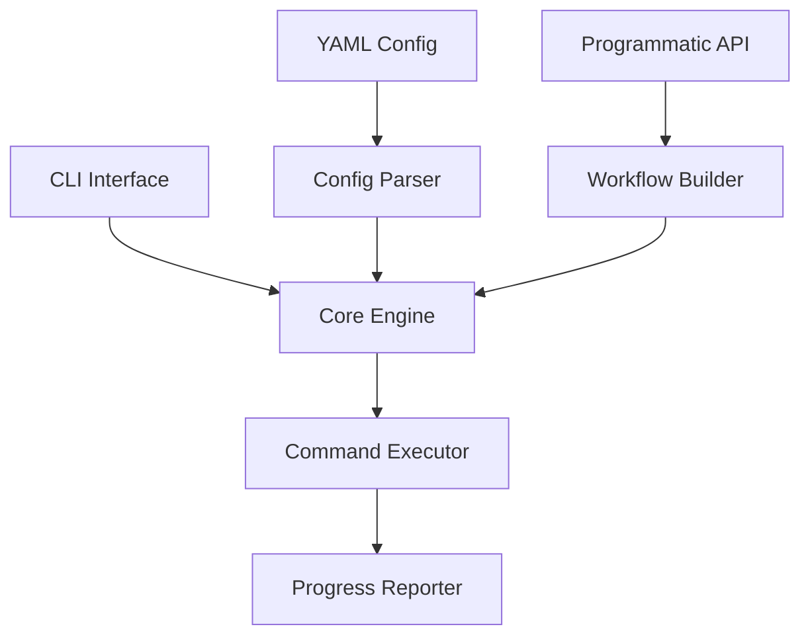

# 🌊 Alvamind Workflow - System Patterns

## Architecture Overview

Alvamind Workflow follows a modular architecture with clearly separated concerns:



## Core Components

### 1. Configuration Layer
- **YAML Parser**: Loads workflow definitions from YAML files
- **Workflow Builder**: Programmatic API for creating workflows
- **Configuration Validator**: Ensures valid workflow structure

### 2. Execution Engine
- **Command Runner**: Executes individual commands
- **Process Manager**: Handles process lifecycle
- **Error Handler**: Manages failures and recovery options

### 3. User Interface
- **CLI**: Command-line interface for running workflows
- **Progress Reporter**: Real-time status updates
- **Interactive Prompt**: For error recovery and branching decisions

## Key Design Patterns

### 1. Builder Pattern
Used in the `WorkflowBuilder` to construct workflow configurations through a fluent interface:

```typescript
createWorkflow()
  .name("My Workflow")
  .execute("command1", "Step 1")
  .execute("command2", "Step 2")
  .build()
```

### 2. Command Pattern
Each workflow step is represented as a command object with execution logic encapsulated:

```typescript
interface Command {
  command?: () => Promise<{ exitCode: number, stdout: string, stderr: string }>;
  name: string;
  skippable?: boolean;
  // ...
}
```

### 3. Strategy Pattern
Different execution strategies (serial, parallel) can be applied to commands.

### 4. Observer Pattern
Progress reporting uses observer-like mechanisms to provide real-time updates.

## Data Flow

1. **Configuration Loading**: 
   - YAML file is parsed or programmatic configuration is built
   - Configuration is validated

2. **Execution Preparation**:
   - Commands are transformed into executable functions
   - Parallel groups are identified
   - Error handling strategies are applied

3. **Command Execution**:
   - Commands are executed in sequence
   - Progress is reported in real-time
   - Errors trigger appropriate recovery flows

4. **Result Reporting**:
   - Final status is determined
   - Execution statistics are calculated
   - Summary is presented to the user

## Error Handling Strategy

1. **Detection**: Identify command failures through exit codes
2. **Recovery Options**:
   - Retry the failed command
   - Execute an alternative command
   - Skip the step (if marked as skippable)
   - Abort the workflow

3. **Visibility**: All errors are reported with:
   - Step identification
   - Error details
   - Time of failure
   - Available recovery options
